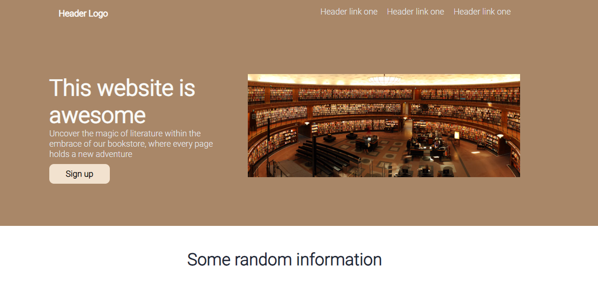

# Recipes Page
This is the [Landing Page](https://www.theodinproject.com/lessons/foundations-landing-page) exercise of the Odin Project curriculum.

## Demo

https://alanox1.github.io/landing-page/

## What I learned is:

Making the page helped me to remember and improve some things about flex, such as flex-grow, flex-shrink and flex-basis.

## PC View:

## Thanks for the images 

- [Tamás Mészáros](https://www.behance.net/repuding) 
- [Tiana](https://www.instagram.com/Diakova_art/) 
- [Polina Zimmerman](https://www.instagram.com/namesofvenus/) 
- [Lum3n](https://www.instagram.com/elum3a/) 
- [cottonbro studio](https://www.instagram.com/cottonbro/) 
